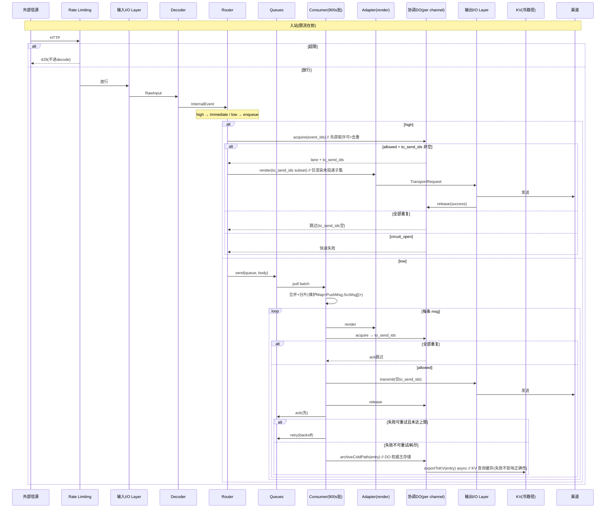

# Generic Event Notification Gateway on Cloudflare Workers
## Design Document (v2.1 — 实测验证版)

> **产物性质**：设计文档（详细技术规格 + 实现约束契约）。含 TypeScript 接口/类型定义、伪代码级流程，以及**关键协调逻辑的实现级不变量约束**。
> **范围**：定义内部标准格式、两端适配器接口、I/O 层、入站限流、协调 DO 的接口与不变量。
> **v2.1 相对 v2.0**：基于 **Spike #7 实测数据**修订。① Consumer CPU 从"实测 ~2000ms"**纠正为 10ms**（~2000ms 是 HTTP fetch 的 burst 天花板，非 queue consumer 持续限额；burst 后会被惩罚到 50ms）；② 发现 **DO 有 30s CPU 预算**（Free 层唯一能做重活的组件）；③ 发现 **CPU burst/惩罚级联模式**（首次 ~2s → exceededCpu → 后续骤降至 10-50ms）；④ `[limits] cpu_ms` 在 Free **不可配**（部署报错）。
> **核心一句话**：数据面（KV+Queues+DO）覆盖到第一吞吐墙；控制面（入站限流+出站熔断+队列削峰）三角保障频率提升时的可用性。**7 个承重假设 + CPU 三层模型全部经实测验证。**

---

## 0. Context

### 0.1 项目定位

部署在 Cloudflare Workers 免费套餐上的**通用通知网关**。任何系统可向它推送消息（HTTP / Email），网关按属性路由，经不同渠道推送通知。与任何特定发送端、接收端解耦。

**核心哲学**：网关不定义外部协议，也不内置第三方适配。它只定义：
- 输入侧内部事件标准格式（Decoder 输出）
- 输出侧内部推送标准格式（Channel Adapter 输入）
- 两端适配器接口（Decoder / Channel Adapter）
- **双侧对称的 I/O 层**（物化传输字节，把 Decoder/Adapter 与传输彻底解耦）
- **入站限流层**（Rate Limiting binding，在 decode/route 前拦掉洪泛）
- **Durable Object 协调层**（强一致协调：并发、去重、熔断）

### 0.2 总体架构

```
外部信源 ──HTTP──► [Rate Limiting] per-source/IP 限流,超限直接429(在decode前)
                        │  放行
                        ▼
                   [输入 I/O Layer] 物化stream→bytes,大小/超时熔断  ◄── Email(经email()handler,自带rawSize防护)
                        │  RawInput
                        ▼
                   [Auth Layer(可选)] → auth_context
                        │
                        ▼
                   [Decoder] 纯解析,无 I/O
                        │  InternalEvent
                        ▼
                   [Router] 路由规则(硬编码常量)
                   ┌──────┴──────┐
        high sev ──┘             └── low sev
             ▼ immediate               ▼ enqueue(写时路由)
    ┌─────────────────┐      ┌──────────────────────────────┐
    │ Adapter.render  │      │   Queues (热路径) 24h保留     │
    │ →TransportReq   │      │   batch@900s 原生retry/vis    │
    └────────┬────────┘      └────────────┬─────────────────┘
             ▼                            │ max_batch_timeout
    ┌─────────────────┐                   ▼
    │ 输出 I/O Layer  │      ┌──────────────────────────────┐
    │ fetch/EMAIL.send│◄─────┤  Consumer(逐条ack/retry)     │
    └────────┬────────┘      │  render→协调DO→transmit      │
             ▼               └────────┬─────────────────────┘
        外部渠道                      │ 不可重试/重试耗尽
             ▲                       ▼
             │              ┌─────────────────────┐
             │              │  协调 DO (per channel)│ 强一致单线程
             │              │  • 并发车道信号量     │ (RPC 模式：idle DO 天然不计 duration ✅实测)
             │              │  • 去重(delivered:ev,只读)│
             │              │  • 熔断状态读写       │
             │              └──────────┬──────────┘
             │                         │ 冷路径归档(DO权威 + KV查询缓存)
             └──────────────┌──────────────────────┐
                            │ KV(冷路径归档)        │
                            │ dlq:/drop:/unmatched: │
                            │ 三类前缀,7天TTL       │
                            └──────────────────────┘
注:高/低严重性路径共用"协调DO"+"输出I/O Layer"，调用策略不同(§4.8)
```

### 0.3 已确认参数

| 维度 | 决策 |
|---|---|
| D1 容量 | 参数化：当前 ~10/天（~1%）／设计上限 ~3,300 低优/天（Queues ops）／DO duration 13k GB-s/天 |
| D2 批节奏 | Queues `max_batch_timeout=900s`（15min 摘要），无需 Cron |
| D3 渠道集 | HTTP 为主 + Email 兜底，代表性 1 email + 2~4 HTTP = 3~5 渠道 |
| D4 Email | 默认打包 Adapter，地位平等，可替换 |
| 架构分层 | 逻辑分层 ≠ 物理多 Worker；单 Worker + DO；Service Bindings 留作 v2+ |
| 双侧 I/O Layer | 输入/输出对称；Adapter 只 `render()` 不联网 |
| 入站防护 | Rate Limiting binding（per-source/IP，在 decode 前拦截洪泛） |
| 协调原语 | Queues（热路径消息）+ 协调 DO（强一致状态）+ KV（冷路径归档） |
| DO 用法 | per-channel 分片 + **RPC 模式**（实测：idle DO 天然不计 duration，不需 WS Hibernation）|
| 可观测性 | 结构化 console 日志；Analytics Engine 作为 v2+ 可选 |

### 0.4 已验证的免费套餐事实（决定设计）

| 原语 | 免费额度 | 用途 |
|---|---|---|
| Worker requests | 100,000/天 | 入站 + Consumer + 限流调用（高于下游墙） |
| Worker CPU (HTTP/Cron) | **10ms（仅 JS，I/O 不计）** | 有 burst 容忍（偶尔 ~2s），但**一旦 exceededCpu 后续骤降至 10ms**。设计按 10ms |
| Worker CPU (Queue consumer) | **10ms** | 同 HTTP；首次 burst ~2050ms 后 exceededCpu，**重试降至 ~50ms**。设计按 10ms |
| Worker CPU (DO) | **✅ 实测 30,000ms（30 秒）** | **Free 层唯一能做重活的组件**（25.9s 安全 / 32.5s 被杀）。`[limits] cpu_ms` 在 Free 不可配，但 DO 默认 30s 已够 |
| Worker memory | 128 MB/isolate | I/O Layer 物化须注意大包 |
| **Rate Limiting binding** | **免费，无额外费用**（仅消耗 Worker req + 极少 CPU） | 入站限流，在 decode 前拦截 |
| **Queues ops** | **10,000/天（读+写+删）** | **第一吞吐墙 ≈ 3,300 低优/天** |
| Queues 保留 | **24 小时（不可配）** | Consumer 宕机 >24h → 低优丢失（可接受） |
| Queues `msg.attempts` | 可读 | consumer 判"最后一次"直接归档 |
| **DO requests** | **100,000/天（独立于 Worker req）** | 协调 DO 的 RPC |
| **DO duration** | **13,000 GB-s/天** | ✅ **实测：36h 仅 19 GB-s（0.15%），RPC 模式即可，不需 Hibernation** |
| DO SQLite rows read | 5,000,000/天 | 去重检查/熔断读 |
| DO SQLite rows written | 100,000/天 | 去重标记/熔断状态写 |
| DO 特性 | per-object 单线程串行化 + 强一致（✅ 实测：并发10个仅1放行） | 分布式协调的原生解法 |
| KV reads | 100,000/天 | 冷路径查询 |
| KV writes | 1,000/天；同 key 1 次/秒 | 冷路径归档（异常产物） |
| KV deletes | 1,000/天 | **用 TTL（expirationTtl=7天）零消耗** |
| Cron Triggers | 5/账号（设计按3） | 仅留作周期清理（可选） |
| subrequests | 50 外部 / 1,000 内部 / 调用 | transmit + DO RPC（internal） |
| 并发出站连接 | 6 / 调用 | DO 信号量全局协调 |

> **塑造设计的五个数字**：Rate Limiting 免费（入站防线）、Queues 10,000 ops/天（吞吐墙）、Queues 24h 保留（耐久性边界）、DO 13,000 GB-s/天（✅ 实测仅用 0.15%）、DO per-object 单线程（✅ 实测串行原子）。

### 0.4b V8 沙盒陷阱（✅ Spike #2/#5 实测发现，实现者必读）

| 陷阱 | 表现 | 应对 |
|---|---|---|
| **V8 时钟冻结（Spectre 缓解）** | `performance.now()` 在同步循环中不推进 → `while (performance.now() - t0 < X)` 会死循环 → CPU 被杀 | **不能用时间控制同步循环**；改用迭代次数（实测 1ms ≈ 20 万次 Math.sqrt）。计时只能在 `await` 之后（时钟解冻点）测宏观 wall time |
| **Self-Fetch Ingress 404** | Worker `fetch()` 自己 → 撞 Ingress 网关回环拦截 → 全盘 404 | 不用 self-fetch 测试；直接在同一 isolate 内调 binding |
| **未读 Response body 死锁** | `fetch()` 不读 `response.text()` → TCP 连接不回收 → 撑爆连接池 → CF 防死锁强杀 | 任何 fetch 必须读 body 或 `body.cancel()` |
| **Rate Limiting N+1 边界** | `limit=N` 实际放行 N+1（从 0 计数，`currentCount <= limit`）| 业务无影响（差 1 个）；文档注明即可 |
| **CPU burst/惩罚级联**（✅ Spike #7）| stateless Worker（fetch/queue/cron）首次超 CPU 时允许 burst 到 ~2s，但**一旦 exceededCpu，后续调用阈值骤降到 10-50ms**。Queue 堆积时尤其危险：一批 burst 被杀 → 重试被杀在 50ms → 雪崩 | **设计按 10ms**，绝不依赖 burst；batch 控制在 10ms CPU 内 |
| **DO 有 30s CPU（不是 10ms）**（✅ Spike #7）| DO 的 executionModel=durableObject，CPU 限制 30,000ms（25.9s 安全 / 32.5s 被杀）。是 Free 层**唯一能做重活**的组件 | 重活（如 MIME 渲染、复杂 JSON 序列化）可放 DO 内做 |
| **DO wall > CPU（调度延迟）**（✅ Spike #7）| DO 的 wallTimeMs 比 cpuTimeMs 多 ~11s（schedulingDelayMs），因 DO 排队等待执行 | 设计按 CPU 时间算预算，不按 wall time |
| **`[limits] cpu_ms` Free 不可配**（✅ Spike #7）| 部署报错 "CPU limits are not supported for the Free plan" | Free 层 CPU 限额由平台固定，不可通过 wrangler 配置调整 |

### 0.5 可用性与扩展性分析（频率提升时由什么保障）

**可用性三角**：

| 防线 | 威胁 | 机制 | 层 |
|---|---|---|---|
| **入站限流** | 单源洪泛饿死合法流量 | Rate Limiting binding：per source_id/IP，decode 前 429，**不耗 DO/KV/CPU** | 第一道 |
| **出站熔断** | 渠道故障反压 | DO `circuit:{adapter}`：连续失败达阈值 → fail-fast，不耗连接/CPU | 第二道 |
| **队列削峰** | 低优瞬时洪峰 | Queues 天然缓冲，批处理消费 | 第三道 |

跨切的协调保障：DO 车道信号量防止高/低优互相饿死（紧急车道语义）。

**Rate Limiting 的边界（诚实说明）**：`limit()` 在 Worker 内调用，**仍消耗 1 次 Worker request**。它保护下游稀缺资源（DO RPC、KV writes、decode CPU），不保护 Worker req 预算本身。但 Worker req 100k/天远高于下游墙（Queues 3,300、KV 1k writes），即便洪水占满 Worker req，下游也已被保护。若要"Worker 运行前就拦"（完全不耗 req），需 zone 级 WAF Rate Limiting Rules（非代码控制，需 zone 托管 CF）——可选增强。

**扩展性评估**：

| 扩展轴 | 评估 | 触墙动作 |
|---|---|---|
| 加 Decoder/Adapter | ✅ 好 | DO 自动按 channel 分片，协调层无需改 |
| 某渠道变热 | ✅ 好 | 它的 DO 独立 scale（per-object 1000 req/s） |
| 低优总量增长 | ⚠️ 受 Queues ops 10k/天限 | 升 Workers Paid（Queues 无日额度上限） |
| 单 Worker size 撞 3MB | ⚠️ Adapter 多时 | Service Bindings 拆分（v2+ 逃生舱） |
| Auth 验签 CPU 撞 10ms | ⚠️ 重验签时 | Service Bindings 拆 Auth（v2+） |
| 跨 Worker 强一致 | ⚠️ | DO 是天然的强一致锚点，拆分后仍可用 |

### 0.6 Non-Goals（显式声明"不做什么"，避免 reviewer 默认该有）

本设计**明确排除**以下范围。它们不是缺陷，是有意的边界——需要时作为后续版本/外部依赖处理：

| 非目标 | 说明 | 若需要 |
|---|---|---|
| **Auth 的具体实现** | 只定义 Auth 接口契约（输入、输出 `AuthContext`、失败行为）；HMAC/Bearer/mTLS 等具体机制不在范围内（与项目初始定义一致）| 实现一个 `Authenticator` 模块插入 §0.2 的 Auth Layer 位置 |
| **跨地域容灾 / 多活** | 单 region、单账号；无跨 zone 故障切换。CF 自身有边缘冗余，但非"容灾"语义 | 需多账号 + 跨 region 部署 + 状态同步（成本显著）|
| **WebSocket / SSE 推送** | 仅支持 HTTP webhook + Email 出站；无长连接实时推送 | 需 DO WebSocket（长期连接占 duration，实测已证明不需要）|
| **消息顺序保证** | 低优经 Queues 批处理，不保证跨消息全局顺序（仅分片内按 timestamp 排序）| 需单队列串行消费（牺牲吞吐）|
| **动态路由配置（运行时改规则）** | 路由规则硬编码常量，改规则需重部署（议题4，已裁定）| 需 KV/D1 存配置 + 管理 API（增复杂度+失败面）|
| **渠道侧的"已读/已送达"回执** | 单向推送，不追踪渠道侧用户行为 | 需渠道支持 + 反向回调链路 |
| **消息内容加密 / 字段级脱敏** | 传输走 HTTPS；存储（KV/DO）不额外加密 body | 需落库前加密 + 密钥管理 |
| **多租户隔离** | 单租户网关；不同 source 共享同一套路由/渠道/配额 | 需 per-tenant 命名空间 + 配额拆分 |
| **完整的 APM / 链路追踪系统** | 仅结构化日志 + v1 最小指标（§可观测性）；无 distributed tracing 后端 | 接入 Analytics Engine + 外部 APM（v2+）|

> **关于 Auth 的边界说明**：项目初始定义即"Auth Layer 的具体实现不在设计范围内，但 Decoder 接口的输入元数据需包含此预留字段"。本设计遵循此边界——§2.5 定义了 Auth 的**接口契约**（机制无关），但**不实现**具体鉴权。部署时若暴露在公网，**强烈建议**先插入一个最小 Auth 实现（如共享密钥 + 时间戳 HMAC）再上线；无 Auth 的裸暴露仅适用于受信内网。

---

## 交付物 1：Internal Event Schema

```typescript
type Severity = "critical" | "high" | "medium" | "low" | "info";

interface TraceRef { source_trace?: string; gateway_trace: string; }
// [F2 补全] gateway_trace 赋值责任：由 **输入 I/O Layer** 在物化时生成（crypto.randomUUID()），
//   写入 RawInput 元数据 → Decoder 透传到 InternalEvent.trace.gateway_trace。
//   source_trace（可选）来自来源侧（如 GitHub delivery ID）；gateway_trace 由网关生成，贯穿全链路。
interface AuthContext { source_id: string; verified: boolean; principal?: string; [k: string]: unknown; }

interface InternalEvent {
  schema_version: "1.0";
  event_id: string;            // UUID；幂等去重核心（DO delivered: 依据）
  source_id: string;           // Router 决策字段
  event_type: string;          // Router 决策字段
  severity: Severity;          // Router 决策字段 + 默认派发依据
  timestamp: string;           // 透传
  title: string;               // 透传
  body: unknown;               // 透传
  trace: TraceRef;             // 透传
  auth_context: AuthContext | null;  // 预留
  metadata: Record<string, unknown>;
}
```

**Router 读取 vs 透传**：读 `source_id`/`event_type`/`severity`；其余原样流入 Push Message。
**严重级别与派发**：默认 `critical|high→immediate`、`medium|low|info→enqueue`；路由规则 `dispatch` 可覆盖。
**版本字段**：`schema_version:"1.0"` 语义化；Router 入口校验 major。

---

## 交付物 2：入站限流 + Decoder Interface + 输入 I/O Layer

### 2.1 入站限流层（第一道防线）

**职责**：在 decode/route **之前**，按 source_id/IP 限流，超限直接 429，**不消耗 DO/KV/CPU**。

```typescript
/** Rate Limiting 配置。threshold/period 声明在 wrangler（CF 平台强制）；运行时由 Worker 传动态 key。 */
interface RateLimitPolicy {
  bindingName: string;          // env 中的 binding 名
  keyStrategy: "source_id" | "ip" | "ip+path" | "global";
  limit: number;                // 每 period 秒允许的请求数（配置项）
  period: 60;                   // 秒
}
// 注册示例：SOURCE_LIMITER(per source_id) + GLOBAL_LIMITER(兜底)

async function checkRateLimit(req: Request, env: Env, sourceId?: string): Promise<boolean> {
  const key = sourceId ?? extractIp(req);   // 优先 per-source，回退 IP
  const { success } = await env.SOURCE_LIMITER.limit({ key });
  return success;
}
// fetch handler 第一件事：checkRateLimit → 不通过则 429，不进入 materialize/decode
```

**位置**：fetch handler 第一行（早于 I/O Layer、Decoder、Router）。
**N+1 边界**（✅ 实测）：`limit=N` 实际放行 N+1（CF 从 0 计数，`currentCount <= limit`）。对业务无影响（差 1 个）。
**Email transport**：经 `email()` handler 入站，自带 rawSize 防护；Email 源受 SMTP 速率限制，限流为可选。
**与 `unmatched:` 采样限流的关系**：Rate Limiting 是广义入站洪泛防护（per-source，429 拦截）；unmatched 采样是专项 KV write 防护。二者互补。

### 2.2 输入 I/O Layer（网关职责）

**职责**：把传输字节**物化**为 `Uint8Array`，统一超时/大小熔断，归一化头。**Decoder 不触碰 stream/I/O。**

```typescript
interface RawInput {
  body: Uint8Array;                    // 已物化
  headers: Record<string, string>;
  source_meta: {
    transport: "http" | "email";
    method?: string; path?: string;    // http
    email?: { from: string; to: string; subject: string };  // email
  };
}
const INPUT_IO_LIMITS = { MAX_BODY_BYTES: 512 * 1024, READ_TIMEOUT_MS: 2000 };
```

物化契约（伪代码）：
```typescript
// Email: message.raw 是 ReadableStream，必须物化（I/O Layer 职责，非 Decoder）
async function materializeEmail(msg: ForwardableEmailMessage): Promise<RawInput> {
  if (msg.rawSize > INPUT_IO_LIMITS.MAX_BODY_BYTES)
    { msg.setReject("552 Message too large"); return reject(413); }  // SMTP 552
  const body = new Uint8Array(
    await withTimeout(new Response(msg.raw).arrayBuffer(), INPUT_IO_LIMITS.READ_TIMEOUT_MS));
  // ... 归一化头 + source_meta.email
}
```

**Email 超大附件退信**：超 `MAX_BODY_BYTES` → SMTP 552 + 邮件头归档 KV `unmatched:`（kind:"oversize_email"）。

**选择器路由**（显式，无模糊匹配）：
```
source_id = path 的 :source_id 段  ??  header["X-Gateway-Source"]
null → 400 ; registry 无此 id → 404
```

### 2.3 Decoder Interface

```typescript
interface RequestMeta { source_id: string; auth_context: AuthContext | null; received_at: string; transport: "http" | "email"; }
interface DecodeError { code: "BAD_BODY" | "UNAUTHORIZED" | "UNSUPPORTED" | "MALFORMED" | "UNKNOWN"; message: string; http_status?: number; }
interface Decoder {
  readonly id: string;
  decode(input: RawInput, meta: RequestMeta): Promise<InternalEvent | DecodeError>;
}
type DecoderRegistry = Record<string, Decoder>;

/** [F4 补全] Worker 环境绑定最小类型（CF 惯例，此前隐式）*/
interface Env {
  SOURCE_LIMITER: RateLimit;        // §2.1 入站限流
  GLOBAL_LIMITER: RateLimit;        // §2.1 全局兜底限流（可选）
  COORDINATOR: DurableObjectNamespace;  // §4.2 协调 DO
  QUEUES: Record<string, Queue<unknown>>;  // §5.2 per-adapter 队列（key=adapter_id）
  KV: KVNamespace;                  // §4.7 冷路径查询缓存
  EMAIL: SendEmail;                 // §4.3 输出 I/O Layer（email 渠道）
}
```

### 2.4 Decoder 生命周期 + Checklist

| 阶段 | 契约 |
|---|---|
| 初始化 | 无状态模块；配置经构造期注入 |
| 执行 | `decode()` 幂等；纯 JS，确定性 CPU < 10ms |
| 异常 | 必须返回 `DecodeError`；裸异常转 `{code:"UNKNOWN"}` |

Checklist：☐ 禁直接访问 `env`；☐ 必须返回 `DecodeError`；☐ **禁读 stream/发起 I/O**；☐ 不假设传输；☐ 确定性生成 `event_id`；☐ 解析 CPU < 10ms。
**新增 Decoder 步骤**：实现接口 → 登记 `DECODER_REGISTRY` → 配 Auth → 路由表加规则 → 配限流策略（如该 source 需特殊限额）→ 提供 Zod fixture。

### 2.5 Auth Layer 接口契约（机制无关，实现不在范围）

**[回应外部审计点2]** Auth 的具体实现（HMAC/Bearer/mTLS）不在本设计范围内（见 §0.6 Non-Goals），但**接口契约必须定义清楚**——否则 `auth_context` 是无意义的空壳，实现者无从对接。

```typescript
/**
 * Auth 中间件接口（机制无关）。
 * 位于 §0.2 的 Auth Layer 位置：I/O Layer 物化之后、Decoder 之前。
 * 网关在调用 Decoder 前，先调用 Authenticator.authenticate()，
 *   成功 → 把 AuthContext 注入 RequestMeta.auth_context；
 *   失败 → 直接返回标准化错误（不进入 Decoder）。
 */
interface Authenticator {
  /**
   * @param input 已物化的 RawInput（含 headers/body，便于做 HMAC 签名校验）
   * @param sourceId 从 path/header 解析的来源标识（用于查该 source 的密钥/策略）
   * @returns AuthContext 成功 | AuthError 标准化失败
   */
  authenticate(input: RawInput, sourceId: string): Promise<AuthContext | AuthError>;
}

/** 鉴权失败（标准化，不抛裸异常） */
interface AuthError {
  code: "UNAUTHORIZED" | "FORBIDDEN" | "BAD_SIGNATURE" | "EXPIRED" | "UNKNOWN";
  message: string;
  http_status: number;   // 401 / 403 等
}
```

**AuthContext 的消费**：Decoder 只**透传**它（不解读字段语义）；Router 不读它做路由（路由只看 source_id/event_type/severity）。AuthContext 的字段（principal、verified、自定义 claims）留给下游/审计使用。

**失败行为契约**：Authenticator 返回 AuthError 时，网关**不调用 Decoder**，直接返回 `AuthError.http_status`（401/403）+ 结构化错误体。这保证未授权请求不消耗 Decoder/Router/Queues 资源。

**Auth 未启用时的行为**：`auth_context = null` 透传，事件正常流转（仅适用于受信内网，见 §0.6 警告）。

> **与限流的关系**：限流（§2.1）在 Auth 之前执行（先挡洪泛，再验身份）。即便未授权的洪水也被限流拦在 decode 前，但会消耗 Worker req——这是 Rate Limiting 的已知边界（§0.5）。若要未授权请求完全不耗 req，需 zone 级 WAF（同 §0.5）。

---

## 交付物 3：Internal Push Message Schema

```typescript
interface PushItem { event_id: string; title: string; body: unknown; severity: Severity; timestamp: string; trace: TraceRef; }
interface InternalPushMessage {
  schema_version: "1.0";
  message_id: string; target_adapter: string; severity: Severity;
  // [契约补全] 合并多 items 时，severity = max(items[].severity)（critical>high>medium>low>info）。
  //   用于 acquire 的车道分配（LANE_ALLOCATION）。取最严重者保证车道不被低估。
  items: PushItem[]; chunk: { index: number; total: number }; attempt: number; created_at: string;
}
```

### 3.1 合并与分片（双阈值）

```typescript
const MAX_ITEMS_PER_MESSAGE = 50;
const MAX_BYTES_PER_MESSAGE = 24_000;  // 渠道接收端余量，与 Queues 64KB 计费无关
const MAX_EMAIL_ITEMS = 10;            // Email Adapter 限（MIME CPU 密集，§4.10）
const estimatedSize = (item: PushItem): number =>
  new TextEncoder().encode(JSON.stringify(item)).length;  // UTF-8 序列化字节长（非内存对象大小）
```

分片：按双阈值切分；单 item 超 24KB 单独成片；0 条不发空消息；分片数受单批大小约束。

### 3.2 分片合并的架构约束（批内合并，非跨批）

**[架构决策修正]** 合并是低优路径的核心价值（50 条合成 1 封邮件），必须保留。但 `Map<PushMessage, Message[]>` 不应是跨 batch 的有状态协调——它不可恢复（Consumer 崩溃即丢）、生命周期不清。

**正确的架构边界：合并发生在单次 Consumer batch 内，不跨 batch。**

```typescript
/**
 * Consumer 一次 batch 收到 N 条 Queues message → 批内合并/分片为 M 个 PushMessage。
 * 映射的生命周期 = 单次 Consumer invocation（不需持久化）。
 * 崩溃 → 整批未被 ack → Queues 重投整批 → 重新合并（幂等，无状态丢失）。
 */
// 批内映射（Consumer 局部，非全局架构状态）
type BatchChunkMap = Map<InternalPushMessage, Message[]>;
```

**ack/retry 正确性（批内）**：
- 一个 PushMessage 成功 → ack 它映射到的所有源 message（批内）。
- 一个 PushMessage 失败需重试 → retry 它映射到的源 message 子集；其余成功的正常 ack。
- 整批崩溃 → 全部未被 ack → Queues 重投 → 重新合并（`delivered` 标记保证已成功的不重发）。

**为什么不跨 batch**：跨 batch 合并需要持久化映射（状态外化到 DO/KV），引入"跨实体有状态协调"——这与 Consumer 的无状态天性冲突。批内合并保持 Consumer 无状态、崩溃安全，且 DO 的 `delivered` 去重已保证跨 batch 不会重复发送。

> **降级声明**：映射是 **Consumer 内部实现细节**（批内局部），非全局架构约束。架构层只保证"合并发生在批内 + DO delivered 去重兜底跨批"。

### 3.3 渲染职责边界
InternalPushMessage **不含渠道特定渲染**。渲染为 `TransportRequest` 是 Adapter 职责；执行是输出 I/O Layer 职责（经协调 DO 闸控）。

---

## 交付物 4：Channel Adapter + 协调 DO + 输出 I/O Layer

### 4.1 Adapter Interface（`render()`，纯渲染不联网）

```typescript
type TransportRequest =
  | { transport: "http";  request: { method: string; url: string; headers: Record<string, string>; body: string } }
  | { transport: "email"; request: { from: string; to: string; raw_mime: string } };
interface SendError {
  code: "RATE_LIMITED" | "UPSTREAM_5XX" | "NETWORK" | "INVALID_MESSAGE" | "CIRCUIT_OPEN" | "UNKNOWN";
  message: string; retryable: boolean; http_status?: number;
}
interface AdapterConfig {
  immediateRetries: number;     // 高优同步重试次数（配置项）
  circuitThreshold: number;     // 熔断阈值（配置项）
  circuitOpenSec: number;       // 熔断时长（配置项）
}
interface AdapterContext { secrets: Record<string, string>; config: AdapterConfig; }
interface ChannelAdapter {
  readonly id: string; readonly config: AdapterConfig;
  render(msg: InternalPushMessage, ctx: AdapterContext): Promise<TransportRequest>;  // 纯渲染,无 I/O,CPU<10ms,幂等
}
type AdapterRegistry = Record<string, ChannelAdapter>;
```

### 4.2 协调 Durable Object（强一致协调中枢）

**为什么需要 DO**：Worker 无状态多租户，内存信号量跨 isolate 不共享。DO 的 per-object 单线程串行化 + 强一致 storage 是"全局可见状态"的原生解法（修复了早期版本的车道模型失效缺陷）。

**分片**：per-channel 一个 DO 实例（`env.COORDINATOR.idFromString(adapter_id)`），天然隔离、避免单 DO 瓶颈。

**协调 DO 接口契约（仅类型）**：

```typescript
/** [F1 补全] 冷路径条目统一信封（被 archiveColdPath/queryColdPath 引用，此前未定义）*/
interface ColdPathEntry {
  kind: "dlq" | "drop" | "unmatched";
  adapter?: string;          // dlq/drop 必填；unmatched 可空（未路由）
  reason: string;            // 人读原因
  attempts?: number;         // dlq 必填（重试次数）
  payload: unknown;          // 原始消息体
  received_at: string;       // ISO timestamp
}

/** severity → 车道分配契约（显式映射，不再隐式） */
const LANE_ALLOCATION: Record<Severity, { primary: "high_exclusive" | "low_exclusive"; overflow: "elastic" }> = {
  critical: { primary: "high_exclusive", overflow: "elastic" },
  high:     { primary: "high_exclusive", overflow: "elastic" },
  medium:   { primary: "low_exclusive",  overflow: "elastic" },
  low:      { primary: "low_exclusive",  overflow: "elastic" },
  info:     { primary: "low_exclusive",  overflow: "elastic" },
};
// 注：路由覆盖 dispatch 策略时，车道分配跟随**原始 severity**（非覆盖后的 dispatch）。
//     severity 是"内容重要性"，dispatch 是"时效性"——二者正交。

interface CoordinatorRpc {
  /**
   * 发送许可：去重检查（只读）+ 车道闸控 + 熔断检查。
   * [关键不变量] acquire 只读检查 delivered:{eid}，不写入任何标记。
   *   标记在 release(success=true) 时才写——否则 transmit 失败后重试会误判为已投递、静默丢消息（§4.5）。
   * 返回 to_send_ids（尚未成功投递的子集），调用方只发送这些。
   * 车道按 LANE_ALLOCATION[severity] 分配。
   */
  acquire(payload: { event_ids: string[]; severity: Severity }): Promise<
    | { allowed: true; lane: "high_exclusive" | "low_exclusive" | "elastic"; to_send_ids: string[] }
    | { allowed: false; reason: "circuit_open" | "lane_full" }>;
  // 若 to_send_ids 为空（全部已投递过）→ 调用方 ack 跳过整批。
  /** 完成后释放车道；success=true 时写入 delivered:{eid} 标记（去重依据）。 */
  release(payload: { event_ids: string[]; lane: string; success: boolean }): Promise<void>;

  // ── 冷路径（DO storage 为权威主存储，KV 为查询缓存，§4.7）──
  /** 归档冷路径条目到 DO storage（权威）。 */
  archiveColdPath(entry: ColdPathEntry): Promise<void>;
  /** 查询该 DO（channel）范围内的冷路径记录（供外部审计）。 */
  queryColdPath(opts: { kind?: "dlq"|"drop"|"unmatched"; since: string; limit: number; cursor?: string }): Promise<{ entries: ColdPathEntry[]; nextCursor?: string }>;

  // ── 只读状态查询（供可观测性，§Observability）──
  /** 当前状态快照：熔断状态、车道占用、delivered 标记数等。 */
  status(): Promise<{
    circuit: Record<string, "open" | "closed">;
    lane_usage: { high_exclusive: number; low_exclusive: number; elastic: number };
    delivered_marker_count: number;
    delivered_marker_ttl_sec: number;
  }>;
  /** 批量检查 event_id 的投递状态（不触发 acquire 语义）。 */
  checkDelivered(event_ids: string[]): Promise<{ delivered: string[]; not_delivered: string[] }>;
}
// DO storage（强一致）：
//   delivered:{event_id}（短TTL，仅 release success 时写）—— 生命周期契约见 §4.5
//   coldpath:{kind}:{adapter}:{nonce}（冷路径权威存储，统一跨层 key）—— §4.7
//   circuit:{adapter}、lane counters
```

**车道模型（DO 持有，全局有效）**：高优独占 1 + 低优独占 1 + 弹性池 4 = 6。高优永远有路走（紧急车道），低优不被饿死。DO 保证同 channel 不超许可数，间接限全局并发连接。
**[实测修正]** DO idle 时天然不计 duration（36h 仅 19 GB-s，0.15% 预算）。**不需 WS Hibernation**——RPC 模式（fetch 唤醒 → 工作 → idle）就够经济。
**熔断**：连续失败达 `circuitThreshold` → DO `circuit:{adapter}=open`，`circuitOpenSec` 内 acquire 直接 `circuit_open`（fail-fast，不耗连接/CPU）。

### 4.3 输出 I/O Layer（经 DO 闸控）

```typescript
const OUTPUT_IO_LIMITS = {
  FETCH_TIMEOUT_SEC: undefined as number | undefined,  // 配置项；高优建议更短
  EMAIL_TIMEOUT_SEC: undefined as number | undefined,
};
async function transmit(
  tr: TransportRequest, env: Env, severity: Severity, adapterId: string, eventIds: string[]
): Promise<{ ok: true; sent_ids: string[] } | { ok: false; error: SendError; sent_ids?: string[] }> {
  const stub = env.COORDINATOR.get(env.COORDINATOR.idFromString(adapterId));
  const acquired = await stub.acquire({ event_ids: eventIds, severity });
  if (!acquired.allowed)
    return { ok:false, error:{ code: acquired.reason==="circuit_open"?"CIRCUIT_OPEN":"UNKNOWN",
            retryable: acquired.reason==="lane_full", message: acquired.reason } };
  if (acquired.to_send_ids.length === 0) return { ok:true, sent_ids: [] };  // 全部已投递过
  try {
    // 仅渲染/发送 to_send_ids 对应的 items
    // 执行 fetch/EMAIL.send + 超时熔断 → {ok:true,sent_ids:to_send_ids}|{ok:false,error,sent_ids}
  } finally { await stub.release({ event_ids: acquired.to_send_ids, lane: acquired.lane, success: /*ok*/ }); }
}
```

### 4.4 死信归档（DO storage 权威主存储 + 先 ack 后归档 + waitUntil）

**[冷路径层级修正]** v1.2 曾用 KV(最终一致,1k writes/天)做主、DO(强一致,100k writes/天)做 fallback——层级颠倒。**冷路径（死信）是最该可靠的，反而放在最不可靠的存储上。** 现修正为：**DO storage 为权威主存储（强一致 + 100k writes/天），KV 降为查询缓存（TTL 7 天供外部审计读）。**

```
consumer 处理一条消息:
  acquired = coord.acquire(...)
  if acquired.allowed and to_send_ids 为空: msg.ack(); return   // 全部已投递过,跳过
  tr = render(msg)
  result = transmit(...)
  if 需重试: coord.release(to_send_ids, lane, success=false); msg.retry(backoff)  // 不标记delivered
  else:      result.ok ? coord.release(to_send_ids, lane, success=true)           // ★ 成功才标记delivered
                   : coord.release(to_send_ids, lane, success=false);
             msg.ack()                // ★ 先 ack（消息不再卡队列）
             if not result.ok: ctx.waitUntil(archiveColdPath(kind, msg, result.error))  // 归档
```

```typescript
async function archiveColdPath(kind, msg, error) {
  const entry = { kind, adapter, reason: error.message, attempts: msg.attempts, payload: msg.body, received_at: now() };
  // ★ DO storage 为权威主存储（强一致，100k writes/天充裕）
  await coordStub.archiveColdPath(entry);
  // 异步导出到 KV（查询缓存，TTL 7 天）；KV 失败不影响正确性（DO 已是权威）
  ctx.waitUntil(exportToKV(entry));
}
async function exportToKV(entry) {
  try { await KV.put(`${entry.kind}:${entry.adapter}:${nonce}`, entry, { expirationTtl: 7*24*3600 }); }
  catch (e) { /* KV 失败仅降级查询能力，不丢数据（DO 已存）。记日志即可 */ }
}
```

> **`ctx.waitUntil()` 是平台强制模式**：`archiveColdPath`/`exportToKV` 是异步的，若不包 `ctx.waitUntil()`，响应/ack 返回后 Worker 可能被回收、归档丢失。实现者必须遵守。
> **为何 DO 做 主、KV 做缓存**：冷路径是"最该不丢"的死信；DO 强一致 + 100k writes/天（KV 仅 1k）使其天然适合主存储。KV 的角色降为"外部审计查询接口"（读多，100k reads/天充裕），失败不影响数据正确性。

### 4.5 去重（DO storage：acquire 只读检查，release 成功后才标记）

**[修复致命缺陷]** 早期版本在 `acquire()` 时**写入** `processed:{eid}` 标记——但若后续 `transmit()` 因可重试错误失败，重试时 `acquire()` 会查到该标记、返回空集、Consumer 直接 ack 跳过，**导致消息静默丢失**（不重试、不进 DLQ、无审计）。

**正确不变量：标记"已投递"只能在 transmit 成功之后写入，不能在之前。**

```
coord.acquire(event_ids):   // DO per-object 单线程 → 只读检查
  to_send = [eid for eid in event_ids if not DO_storage.get("delivered:"+eid)]
  // ★ 只读，不写。transmit 还没发生，不能提前标记。
  return { allowed:true, to_send_ids: to_send, lane:... }   // 返回待发送子集

coord.release(event_ids, lane, success):
  if success:
    for eid in event_ids:
      DO_storage.put("delivered:"+eid, {ts}, {ttl:DEDUP_TTL})  // ★ 仅成功后才标记
  // 释放车道信号量（无论成败）
```

**失败路径（修复后）**：
```
1. acquire(E1) → to_send=[E1]（只读，未标记）
2. transmit → 失败(5xx)
3. release(success=false) → 不写 delivered 标记
4. msg.retry(backoff)
5. 重投 → acquire(E1) → delivered:E1 不存在 → to_send=[E1]  ← 正常重试 ✅
6. transmit → 成功
7. release(success=true) → 写 delivered:E1
8. msg.ack()
```

**崩溃路径的权衡（诚实说明）**：若 consumer 在 transmit 成功后、release(success=true) 之前崩溃，`delivered:E1` 未标记 → 重投后会**重复发送一次**。但这是 at-least-once 语义的固有代价——下游幂等（Adapter render 同 message_id 产相同信封 + 渠道按 event_id 去重）是兜底。**重复发送 ≪ 静默丢失**，这是正确的取舍。

命名精确化：`processed:{eid}` → `delivered:{eid}`（"已投递"比"已处理"更精确——只有成功发送才算 delivered）。

**delivered:{eid} 生命周期契约（缺陷 #2 补全）**：

| 生命周期事件 | 行为 | 依据 |
|---|---|---|
| **TTL 取值（DEDUP_TTL）** | 推荐 = `max_batch_timeout + visibility_timeout + 安全余量`（如 900s + 30s + 余 ≈ 1000s）。覆盖 Queues 可能的重投窗口；过期后允许同名事件再发（合理，太久前的重复无意义）| 与 Queues 重投窗口对齐 |
| **DO 代码重部署** | DO storage **保留**（除非显式 `--reset`）。`delivered` 标记不因部署丢失。CF 默认部署保留 storage | DO 是有状态实体，storage 与代码版本解耦 |
| **DO storage 满（5GB 共享）** | 写入失败（SQLITE_FULL）；读取继续。**冷路径归档**（`coldpath:`）与 `delivered` 共享 5GB——优先策略：`delivered` 用短 TTL 自动过期，`coldpath` 用 7 天 TTL，两者都不会永久占满 | 官方：满时写失败、读/删继续 |
| **TTL 过期后重复事件** | 放行重发——**这是设计意图**（窗口外的重复视为新事件）。幂等 Adapter（render 同 message_id 同信封）兜底 | 短窗口去重 + 长期靠幂等 |
| **DO 重启/Hibernation 恢复** | storage 持久（Hibernation 不丢 storage）；内存态 lane counters 需从 storage 恢复或重置 | Hibernation 持久化 storage，非内存 |

> **关键不变量**：`delivered:{eid}` 的正确性依赖"短 TTL 窗口内有效"。若窗口设得过短（< 重投窗口），可能重复发送；过长则浪费 storage。推荐值见上表，配置项留实现按实际 Queues 行为微调。

### 4.6 重试退避策略（策略定义，数值留实现）

指数退避 + 上限 + jitter + 尊重 Retry-After；依据 `msg.attempts`。
```typescript
interface BackoffStrategy { nextDelaySec(attempts: number, error: SendError): number; }
```

### 4.7 冷路径存储层级（DO 权威 + KV 查询缓存）

**[层级修正]** 冷路径的**权威存储 = DO storage**（强一致，100k writes/天），**KV = 查询缓存**（TTL 7 天，供外部审计读）。

| 存储层 | 角色 | 一致性 | 写额度 | TTL | 失败影响 |
|---|---|---|---|---|---|
| **DO storage（权威）** | 冷路径主存储（死信/丢弃/无匹配的真相源）| 强一致 | 100,000/天 | 7 天（应用层清理）| 写失败=数据丢失（应告警）|
| **KV（查询缓存）** | 外部审计查询接口（读多）| 最终一致 | 1,000/天 | 7 天（expirationTtl）| 失败仅降级查询，不丢数据 |

**DO storage 冷路径 key**：`coldpath:{kind}:{adapter}:{nonce}`（kind ∈ dlq/drop/unmatched）。
**KV 镜像 key**：与 DO **统一格式** `coldpath:{kind}:{adapter}:{nonce}`（供外部 `KV.list({prefix:"coldpath:dlq:slack-webhook:"})` 按 adapter 高效前缀扫描）。
> [契约修正] 早期版本 DO/KV key 格式不一致（跨层关联需读 body）。现统一为 `coldpath:{kind}:{adapter}:{nonce}`，三层都含，便于跨层关联与按 adapter 扫描。
**同步**：`archiveColdPath` 写 DO 后，异步 `exportToKV`（§4.4）；KV 失败不影响正确性。

**查询接口**：外部审计经 `coordStub.queryColdPath({kind, since, limit, cursor})`（§4.2）查询 DO；或经 `KV.list({prefix})` 查询缓存。前者权威、后者更快。

**`unmatched:` 采样限流**：窗口（如 5min）仅归档 1 样本 + 计数；样本 drop body 只存摘要。即便被刷，归档量 = 窗口数/天（DO 100k writes 充裕；KV 1k 也够因采样）。

### 4.8 高优先级路径详述（immediate）

| 维度 | 高优（immediate） | 低优（Consumer 驱动） |
|---|---|---|
| 驱动 | HTTP 请求内同步 | Queues batch + 平台重试 |
| 车道 | 高优独占优先，溢出弹性池 | 低优独占优先，溢出弹性池 |
| transmit 超时 | 较短（配置项） | 较宽松（配置项） |
| 失败语义 | **不降级入低优队列**；尽力返回 + 记 `drop:` | retryable→Queues 重投；不可重试→`drop:` |
| 重试次数 | `AdapterConfig.immediateRetries`（配置项） | Queues `max_retries` |
| 去重 | 经协调 DO acquire（返回 to_send_ids） | 经协调 DO acquire |
| CPU | HTTP 10ms | Queue consumer 10ms（burst ~2s 后惩罚降至 50ms；设计按 10ms）|

**多 Adapter 发送语义（含失败语义）**：
```typescript
type DispatchStrategy = "all" | "first_success";
```
| 策略 | 行为 | 失败语义 |
|---|---|---|
| `all`（fan-out）| 所有 adapter 各自经各自 DO 独立发送 | 彼此隔离；一个失败只归档该 adapter，不影响其他 |
| `first_success`（failover）| 按 `adapters` 顺序尝试，首个成功即止 | 成功后跳过后续；后续 adapter 不执行。重试时若首个已标 delivered→acquire 返回空→ack 跳过；否则重新从首个尝试（幂等 Adapter 兜底）|

> **first_success 重试一致性**：审计担心的"重试命中不同 adapter"由 `delivered`（§4.5）兜底——首个成功已标 delivered，重试 acquire 返回空集→ack。审计建议的 `record_first_success` 冗余（delivered 已是此语义）。

### 4.9 新增 Adapter 步骤 + Email 性能约束
实现接口（含 config）→ 登记注册表 → 声明密钥 → 路由表加规则 → mock fixture。Email 默认打包；`MAX_EMAIL_ITEMS=10`（MIME CPU 密集）。

---

## 交付物 5：Gateway Core Flow（限流 + Queues + DO 主驱动）

### 5.1 端到端时序



### 5.2 Queues 队列设计（写时路由，per-adapter）
每个 `adapter_id` 一个 Queue，隔离批节奏与背压。
> **多队列 vs 单队列权衡**：多队列的空轮询通常不计 ops；单队列需批内分组（增 CPU）。当前规模保留多队列；未来渠道多且空闲时可迁单队列+分组。

### 5.3 并发、去重与背压（DO 协调 + 轻量控制面闭合）

去重=DO `delivered:` 只读检查(acquire)＋成功后标记(release)；返回 to_send_ids；并发车道=DO 信号量（全局）；熔断=DO `circuit:`；visibility_timeout+个别 ack/retry（Queues 原生）；at-least-once 兜底=幂等 Adapter。

**熔断期间的控制面行为（缺陷 #1 的轻量闭合）**：
当某 channel 的 `circuit:{adapter}=open` 时，Consumer 对该 channel 的消息行为——**retry 而非 ack**：
- `acquire` 返回 `circuit_open` → Consumer `msg.retry({delaySeconds: circuitOpenSec})`（延后到熔断预期恢复后重投），**不 ack、不归档**。
- 消息留在 Queues（24h 保留），熔断恢复后自然被重新消费。
- **这本身就是背压（backpressure）**：熔断期间该 channel 的队列积压增长是预期的（"渠道挂了，消息等着"），而非缺陷。
- **羊群效应缓解**：熔断恢复后积压涌入，由退避策略的 **jitter**（§4.6）打散重投节奏，避免同时打爆刚恢复的渠道。

> **为何不引入 BackpressureSignal 闭环**：审计建议的"DO 暴露 backpressureStatus、限流动态调阈值"是重型分布式控制系统，对免费层网关（设计上限 3,300/天）过度设计。已有的 retry+延后 + jitter 已闭合控制面（熔断→Consumer retry→队列暂存→恢复后散开重投），无需新增信号通道。

### 5.4 批节奏与 Cron
批节奏=Queues `max_batch_timeout=900s`；Cron 降级为可选周期清理。

### 5.5 限度瓶颈与防御

| 约束 | 消耗 | 预算 | 防御 |
|---|---|---|---|
| Worker requests | 入站+consumer+限流调用 | 100,000/天 | 限流保护下游；高于下游墙 |
| **入站洪泛** | 单源刷 | — | **Rate Limiting binding（decode 前 429，不耗下游）** |
| Queues ops | 3 ops/低优条 + 重试 | 10,000/天 → ~3,300/天墙 | 触墙→升付费 |
| DO requests | 每 transmit 2 RPC（✅实测 9ms/次） | 100,000/天 | RPC 合并降请求数 |
| DO duration | 仅 active（✅实测 0.15%）| 13,000 GB-s/天 | RPC 模式即可 |
| DO rows written | 去重标记+熔断 | 100,000/天 | 去重短TTL；熔断低频 |
| Worker CPU | render/route/chunk | 10ms (HTTP)/保守10ms(consumer) | I/O Layer 与 Adapter 拆分 |
| subrequest | transmit+DO RPC(internal) | 50 外部/1,000 内部 | DO 算 internal |
| 并发连接 | transmit 并发 | 6/调用 | DO 信号量全局协调 |
| KV writes | 冷路径归档 | 1,000/天 | 异常产物本就该少；TTL 零 delete；DO fallback |

**触墙迁移**：低优 ~3,300/天 或 DO req 逼近 100k → 升 Workers Paid。

### 5.6 路由规则（硬编码常量 + 显式 Router 接口 + 发送策略）

**Router 接口（显式，便于测试边界清晰）**：
```typescript
interface RouteResult {
  adapter_ids: string[];
  dispatch: DispatchPolicy;       // immediate | enqueue
  strategy: DispatchStrategy;     // all | first_success
}
interface Router {
  /** 路由决策：InternalEvent → 目标 adapter 列表 + 策略；null = 未匹配（走兜底）*/
  route(event: InternalEvent): RouteResult | null;
}
```

```typescript
interface RouteMatch { source_id?: string; event_type?: string; severity?: Severity; }
type DispatchPolicy = "immediate" | "enqueue";
type DispatchStrategy = "all" | "first_success";
interface RoutingRule { match: RouteMatch; adapters: string[]; dispatch?: DispatchPolicy; strategy?: DispatchStrategy; }
const ROUTING_TABLE: { version: "1.0"; rules: RoutingRule[] } = {
  version: "1.0", rules: [
    { match:{source_id:"github-ci",event_type:"build.failed",severity:"high"}, adapters:["slack-webhook","email-mailchannels"], dispatch:"immediate", strategy:"all" },
    { match:{source_id:"monitor",severity:"info"}, adapters:["email-mailchannels"] },
    { match:{source_id:"monitor",severity:"high"}, adapters:["slack-webhook","email-mailchannels"], dispatch:"immediate", strategy:"first_success" },
    { match:{}, adapters:["email-mailchannels"] },   // 兜底
  ],
};
```
**默认链路**：无匹配（route 返回 null）→ 转发默认 email + 归档 `unmatched:`（采样限流）。

---

## 交付物 6：Verification Approach

### 6.1 Schema 静态校验（Zod）
```typescript
const InternalEventSchema = z.object({ schema_version:z.literal("1.0"), event_id:z.string().uuid(),
  source_id:z.string().min(1), event_type:z.string().min(1), severity:SeveritySchema, timestamp:z.string().datetime(),
  title:z.string(), body:z.unknown(), trace:z.object({source_trace:z.string().optional(),gateway_trace:z.string().min(1)}),
  auth_context:z.object({source_id:z.string(),verified:z.boolean(),principal:z.string().optional()}).passthrough().nullable(), metadata:z.record(z.unknown()) });
// [契约修正] auth_context 用 .passthrough() 匹配 TS 接口的索引签名 [k:string]:unknown。
//   否则 Authenticator 注入的自定义 claims 会被 .strip() 静默丢弃。
const TransportRequestSchema = z.discriminatedUnion("transport", [ /* http/email */ ]);
```
校验点：Router 入口、Consumer 出口、I/O Layer 入口。

### 6.2 限流 + Decoder + Adapter + 协调 DO Mock 验证
```typescript
function mockRateLimiter(scenarios: { success: boolean }[]): { limit: (k:{key:string})=>Promise<{success:boolean}> };
function mockDecoder(id, table): Decoder;
function mockAdapter(id, config): ChannelAdapter & { rendered: TransportRequest[] };
/** Mock 协调 DO：注入 acquire 场景（含 to_send_ids 子集） */
function mockCoordinator(scenarios: { acquireResult: AcquireResult }[]): CoordinatorRpc;
```
- **限流**：N 次放行后第 N+1 次超限 → 429 且**不调用** decode/DO。
- Decoder/Adapter：合法/非法、幂等。
- **协调 DO**：注入"全部重复→to_send_ids 空→ack跳过"、"部分重复→to_send_ids 子集→仅发子集"、"circuit_open"；acquire/release 配对。
- **分片映射**：构造批含跨 PushMessage 的源消息，验证 Map<PushMsg,SrcMsg[]> 的 ack/retry 正确性。
- I/O Layer transmit：mock fetch + mock coordinator，断言 retryable + 车道释放 + 仅发 to_send_ids。

### 6.3 合并与分片算法行为验证（极端堆积）
Case A 条数(51→2片)；B 体积(2×20KB→2片)；C 极端堆积(1000→20片,Σitems==1000)；D 单件超阈；E 空；F 排序；G Email限批(12件→10+2)。不变量：Σitems==输入；每片≤50且≤24KB(除D)；Email≤10；chunk 无缺重。

---

## 可观测性（v1 最小指标 + v2+ 规划）

**[回应外部审计点4]** 对一个连接外部渠道的网关，盲操作不可接受。v1 不需要完整 APM，但**第一版必须**能回答："哪些 adapter 熔断了？队列积压多深？冷路径归档成不成功？"

### v1 最小指标集（第一版必须实现）

| 指标 | 来源（原生，无需自建）| 回答的问题 |
|---|---|---|
| **队列积压深度** | `env.QUEUE.metrics()` → `backlogCount`/`backlogBytes`/`oldestMessageTimestamp`（CF 2026-04 原生）| Consumer 跟得上吗？积压在涨吗？ |
| **哪些 adapter 熔断** | 协调 DO 的 `circuit:{adapter}` 状态（已在 DO storage，§4.2）| 哪个渠道挂了？ |
| **冷路径归档成功率** | `archiveColdPath` 写 DO 的成功/失败计数（§4.4）| 死信/丢弃有没有丢？ |
| **限流命中率** | Rate Limiting `limit()` 返回 success=false 的计数（§2.1）| 哪个 source 在刷？ |
| **Consumer 错误率** | transmit 返回 retryable 失败的计数（§4.3）| 下游渠道健康吗？ |

### 指标暴露方式（v1：结构化日志；v2+：Analytics Engine）

**v1（结构化 console 日志，零额外组件）**：每个关键事件输出 JSON 日志，含 `trace_id`/`adapter`/`event`/`error_code`/计数值。通过 Workers Dashboard / wrangler tail 可查。
```typescript
console.log(JSON.stringify({ level:"info", event:"transmit_result", adapter, success:true, duration_ms, trace_id }));
console.log(JSON.stringify({ level:"warn", event:"circuit_open", adapter, failures, threshold }));
console.log(JSON.stringify({ level:"error", event:"coldpath_kv_fail", kind, fallback:"do_storage", error }));
```

**v2+（Analytics Engine，免费，规模上升时引入）**：把上述计数写入 Analytics Engine 数据点，支持 SQL 查询与大盘：
- **指标**：队列深度时序、渠道错误率 p99、render/transmit 耗时 histogram、限流命中率、DLQ inflow rate。
- **能力**：单 invocation 写 250 数据点，blob≤16KB，留存 3 个月。
- **何时引入**：当 console 日志不足以回答"过去 24h 健康趋势"时。

### v1 指标的最小不变量（实现者必须遵守）

- ☐ Consumer 每次 batch 结束记录 `env.QUEUE.metrics()` 到日志（队列深度）。
- ☐ 熔断状态变化（open/close）必须 console.log（含 adapter + 原因）。
- ☐ `archiveColdPath` 写 DO 失败必须 console.error（DO 是权威，写失败=数据丢失风险）。
- ☐ `exportToKV` 失败仅 console.warn（KV 是缓存，失败不影响正确性）。
- ☐ 所有关键日志含 `trace_id`（来自 InternalEvent.trace.gateway_trace），便于关联。

---

## Edge Cases / Boundary Conditions

| 场景 | 处理 |
|---|---|
| **单源洪泛** | Rate Limiting binding 在 decode 前 429（不耗下游） |
| message.raw stream/大邮件 | I/O Layer 熔断 → SMTP 552 + 归档头 |
| 物化 body > 512KB | 413/552 |
| Decoder 非法 Event | Router 入口 Zod 失败 → 标准化错误 |
| render 失败 | `INVALID_MESSAGE`(retryable:false) → `drop:` |
| transmit 429/5xx | retryable → consumer retry(退避) |
| 重试耗尽 | 先 ack → `ctx.waitUntil(archiveColdPath)` 写 DO（权威）+ 异步 exportToKV（缓存）|
| 不可重试(4xx) | ack → `ctx.waitUntil(drop:)` |
| **KV 写冷路径失败** | 降级 DO storage + console.error |
| **同 event_id 重复** | 协调 DO acquire 返回 to_send_ids（仅发未重复子集）+ 幂等 Adapter |
| **全部 event_id 重复** | to_send_ids 为空 → ack 跳过整批 |
| **车道全局过载** | 协调 DO 信号量全局协调 |
| **渠道持续故障** | 熔断（DO circuit），fail-fast |
| 无匹配路由 | 兜底 → email + 归档 `unmatched:`（采样限流） |
| Consumer 宕机 >24h | 队列消息丢失（低优可接受）；死信在 KV/DO 7 天 |
| DO overloaded | 返 overloaded → consumer retry；按 channel 分片降压 |
| 多 adapter fan-out 超 6 连接 | `strategy:first_success` 减并发；或拆批 |
| **分片 retry 溯源** | 经 Map<PushMsg,SrcMsg[]> 回溯源消息（§3.2） |
| Auth Layer 未启用 | `auth_context=null` 透传 |

---

## Implementation Plan / Phasing（最小可行路径）

**[回应外部审计点3]** 设计文档定义了最终态全部组件，但不回答"先做什么"。以下是按依赖顺序的最小可行路径（MVP→完整态），供实现排期。

### Phase 0：骨架与无状态链路（验证 I/O + Decoder + Router）
**目标**：能收 HTTP、能 decode、能路由、能 render 出 TransportRequest。**不含任何发送。**
- 输入 I/O Layer（materialize）
- Decoder Interface + 至少 1 个 Decoder 实现
- Router（路由表硬编码）
- Adapter Interface + render()（仅打印 TransportRequest，不 transmit）
- Zod 校验（交付物6）

**验收**：POST 一个 webhook → 看到 decode 后的 InternalEvent + render 出的 TransportRequest 日志。

### Phase 1：单渠道高优同步路径（能真正推送）
**目标**：高优事件能同步推送到一个渠道（如 email）。
- 输出 I/O Layer 的 transmit（fetch/EMAIL.send）+ 超时熔断
- 至少 1 个 Adapter 实现（email-mailchannels）
- 高优路径（immediate）端到端打通

**验收**：POST 高优事件 → 真实收到邮件/webhook。**此阶段可不接 DO/Queues**——纯同步路径即可工作（最小可行）。

### Phase 2：协调 DO（并发/去重/熔断）
**目标**：引入强一致协调，修复无状态缺陷。
- 协调 DO（per-channel 分片，RPC 模式）
- acquire（返回 to_send_ids）/ release / archiveColdPath / queryColdPath / status / checkDelivered
- 车道信号量 + 熔断状态
- 高优路径接入 DO 闸控

**验收**：重复 event_id 被去重；熔断开启后快速失败；车道隔离有效。

### Phase 3：Queues 低优批处理路径
**目标**：低优事件入队、批处理、合并分片、消费推送。
- Queues producer（Router 写时路由）
- Consumer（batch + 合并/分片 + §3.2 映射 + 逐条 ack/retry）
- 死信归档（先 ack 后 ctx.waitUntil archiveColdPath 写 DO + exportToKV 缓存）
- 退避策略（BackoffStrategy）

**验收**：POST 低优事件 → 15min 内收到合并推送；失败可重试；耗尽归档 KV。

### Phase 4：入站限流 + 可观测性
**目标**：补齐控制面，生产可用。
- Rate Limiting binding（§2.1）
- v1 最小指标集（§可观测性）：队列深度、熔断、冷路径、限流命中、错误率
- unmatched 采样 + 默认链路

**验收**：洪泛被限流；熔断可见；冷路径失败有日志。

### Phase 5（可选/v2+）：增强
- Analytics Engine 大盘
- 更多 Decoder/Adapter
- Service Bindings 拆分（若撞 CPU/size）
- Auth 实现（若公网暴露）

> **关键洞察**：Phase 1（纯同步高优）即可作为"最小可行产品"——它不依赖 DO/Queues/KV 冷路径，能在几小时内跑通真实推送。后续 Phase 逐步加固。这给了实现一个清晰的"先跑起来再加固"路径，而非"全部做完才能用"。

| 版本 | 关键变更 |
|---|---|
| v1.0 | KV+Cron 热路径（KV 写墙 1k/天）|
| v1.1 | Queues 替代 KV 热路径（3.3k/天）；双侧 I/O Layer；Adapter `render()` 拆传输 |
| v1.2 | Durable Object 协调层（并发/去重/熔断）；修复车道无状态失效、幂等不充分、DLQ 丢失 |
| v1.3 | Rate Limiting binding 入站限流；可用性三角（入站限流+出站熔断+队列削峰） |
| **v1.4** | 契约精确化：`acquire` 返回待发送子集；`ctx.waitUntil()` 显式标注；分片↔源消息映射声明 |
| **v1.5** | **修复去重致命缺陷**：delivered 标记从 `acquire`（发送前）移至 `release(success=true)`（发送成功后），防止 transmit 失败后重试被误判为已投递导致静默丢失；`processed:`→`delivered:`；新增 Non-Goals / Auth 接口契约 / Phasing / v1 可观测性 |
| **v1.6** | **架构结构性修正**：① 冷路径层级翻转（DO 权威主存储、KV 查询缓存）——修复 KV 主/DO fallback 的层级颠倒；② 控制面轻量闭合（熔断→Consumer retry+延后+队列暂存+jitter 散开，否决重型 BackpressureSignal）；③ delivered:{eid} 生命周期契约补全（TTL 取值依据/重部署/满存储）；④ 分片映射降级为批内实现细节（保留合并，崩溃安全）；⑤ 显式 Router 接口 + Severity→Lane 映射 + DispatchStrategy 失败语义 + DO 只读查询接口(status/checkDelivered/queryColdPath) |
| **v1.7** | **契约闭合 + 定位校准**：① 补 ColdPathEntry 定义（被公开接口引用却未定义）；② 补 gateway_trace 赋值点（输入 I/O Layer 生成）；③ 补 Env 最小类型；④ 时序图高优路径 render→acquire 顺序修正为 acquire→render(subset)；⑤ coldpath key 跨层统一为 `coldpath:{kind}:{adapter}:{nonce}`；⑥ PushMessage.severity=max(items)；⑦ auth_context Zod 加 .passthrough()；⑧ 更新开头定位声明（如实描述含实现级不变量约束）；⑨ 版本号统一 v1.7 |
| **v2.0** | **实测验证版**（Spike #1-#6 全部通过）：① Consumer CPU 从"保守 10ms"修正为"实测 ~2000ms"（**后被 v2.1 纠正**）；② DO Duration 从"必须 Hibernation"修正为 RPC 模式即可；③ 新增 V8 沙盒陷阱；④ Rate Limiting 补 N+1 说明 |
| **v2.1** | **Spike #7 CPU 精测纠正**：① Consumer CPU 从"~2000ms"**纠正回 10ms**（~2000ms 是 stateless Worker 的 burst 天花板，非持续限额；burst 后惩罚降至 50ms）；② 发现 **DO 有 30s CPU**（Free 层唯一重活组件）；③ 发现 **CPU burst/惩罚级联模式**；④ `[limits] cpu_ms` 在 Free **不可配**（部署报错）；⑤ Cron Trigger 同样按 10ms |
